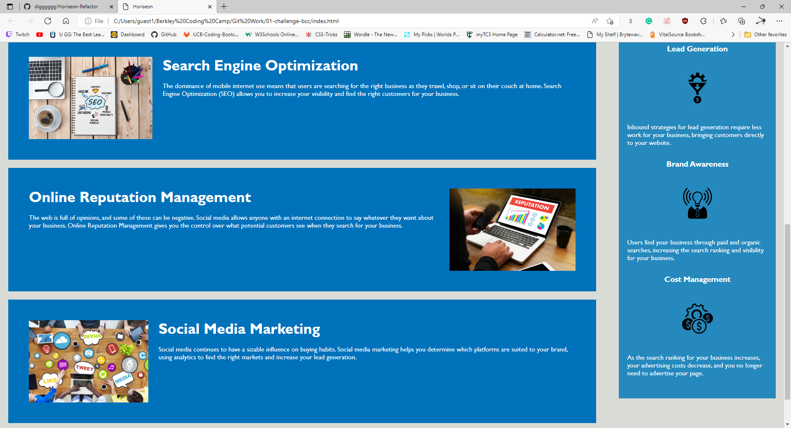

# Horiseon-Refactor

## Description

Using WCAG 2.1 accessabilty guidelines I did a refactor on the website without changing the pages original look. Fixing the title tag, removing unecessary css, adding html, and adding alts to iamges were done to improve the accessability to the website. Vscode is the primary IDE I use in conjunction with Github to fix the issues quickly.

## Table of Contents

* [Installation](#installation)
* [Usage](#usage)
* [Credits](#credits)
* [License](#license)

## Installation

Git clone repository

## Usage 

Git clone repository and then open the index.html file.

## Credits

Jerome Chenette

## License
[LICENSE](/LICENSE.md)

## Badges

